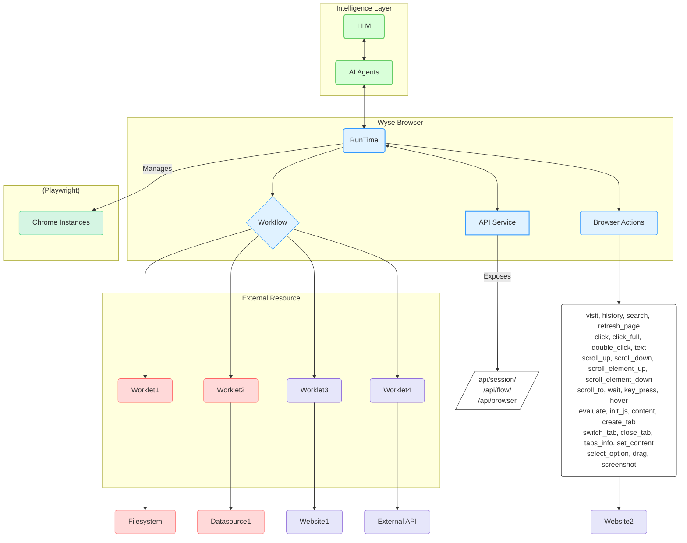

# Wyse Browser 🚀

[English](README.md) [简体中文](README_zh-CN.md)

[](https://github.com/wyse-work/wyse-browser)
[](https://opensource.org/licenses/Apache-2.0)
[](CONTRIBUTING.md)

Wyse Browser is a powerful, multi-process runtime engine designed for executing automated flows within a browser environment. It provides a robust platform for creating, managing, and executing complex automation workflows through a comprehensive REST API.

## Key Features 🌟

-   **Powerful & Scalable Automation Core** ✨: Built on NestJS and Playwright, Wyse Browser provides a reliable and efficient multi-process runtime engine. It orchestrates multiple sandboxed Chrome instances, enabling robust and scalable browser automation.
-   **AI-Driven Workflow Orchestration** 🧠: Designed to integrate seamlessly with LLMs and AI Agents, facilitating the creation, management, and execution of sophisticated, AI-driven automation workflows.
-   **Modular & Extensible Worklets** 🧩: Leverage Worklets as autonomous, reusable, and highly composable code blocks for specific tasks, allowing for flexible and extensible automation solutions.
-   **Comprehensive REST API Control** 🔗: Offers a full-featured REST API for programmatic control over every aspect of the browser environment, including sessions, pages, flows, and individual browser actions.
-   **Parallel & Isolated Session Execution** ⚡: Manages multiple independent browser sessions in parallel, each running in a sandboxed Chrome instance with isolated contexts (cookies, local storage), ensuring tasks run without interference.
-   **Rich & Granular Action Space** 🤖: Provides a wide array of built-in, low-level browser actions—from navigation and clicking to executing custom JavaScript—offering precise control over browser interactions.

## Architecture 🏗️



## Core Concepts ✨

-   **Session** 🌐: A dedicated, isolated browser environment (a sandboxed Chrome instance) that provides a consistent context for executing workflows and browser actions. Each session manages its own cookies, local storage, and pages (tabs), ensuring that automated tasks run without interference from other operations.
-   **Browser Actions** 🤖: The fundamental building blocks for automation within a session. These are low-level, atomic operations that can be executed on a browser page, such as `visit` a URL, `click` an element, `type` text, or `take a screenshot`. These actions are exposed through a comprehensive API, allowing for granular control over browser interactions.
-   **Workflow** 🚀: Defines a precise sequence of worklets executed in a specific order. Workflows are designed and created by AI agents to automate complex multi-step tasks within the browser. Each workflow maintains isolated data connections and state, ensuring independent and reliable execution.
-   **Worklet** 🧩: A reusable, autonomous, and highly composable code block dedicated to performing a specific task. Worklets act as the modular units of automation, encapsulating logic for interactions with external resources or complex browser operations. They can be implemented in various languages and function as local processes or remote services, allowing for flexible and extensible automation.


## Getting Started 🏁

### Prerequisites 🛠️

- Node.js (v20.x or later)
- pnpm

### Installation ⬇️

1.  Clone the repository:
    ```bash
    git clone https://github.com/wyse-work/wyse-browser.git
    cd wyse-browser
    ```

2.  Navigate to the browser engine directory and install dependencies:
    ```bash
    cd browser
    pnpm install
    ```

3.  Build all worklets:
    ```bash
    ./build_worklets.sh
    ```

4.  Run the API development server:
    ```bash
    pnpm run start:dev
    ```
    The API server will be running at `http://127.0.0.1:13100`.

## Quick Start: Usage Example ⚡

Here's a quick example of how to use `curl` to create a session, navigate to a page, and take a screenshot.

1.  **Create a new session:**
    ```bash
    SESSION_ID=$(curl -s -X POST http://127.0.0.1:13100/api/session/create \\
    -H "Content-Type: application/json" \\
    -d '{}' | grep -o '\"session_id\":\"[^\"]*\' | cut -d\'\"\' -f4)

    echo "Session created with ID: $SESSION_ID"
    ```

2.  **Perform a "visit" action:**
    ```bash
    curl -X POST http://127.0.0.1:13100/api/browser/action \\\
    -H "Content-Type: application/json" \\\
    -d \'{\n      \"session_id\": \"\'\"$SESSION_ID\"\'\",\n      \"action_name\": \"visit\",\n      \"data\": { \"url\": \"https://www.google.com\" }\n    }\'
    ```

3.  **Take a screenshot:**
    ```bash
    curl -X GET http://127.0.0.1:13100/api/session/$SESSION_ID/screenshot
    ```

## API Reference 📚

Please refer to [API_REFERENCE.md](API_REFERENCE.md) for the complete API reference.

## Contributing 🤝

Contributions are welcome! Please feel free to submit a pull request.

1.  Fork the repository.
2.  Create your feature branch (`git checkout -b feature/AmazingFeature`).
3.  Commit your changes (`git commit -m 'Add some AmazingFeature'`).
4.  Push to the branch (`git push origin feature/AmazingFeature`).
5.  Open a Pull Request.


