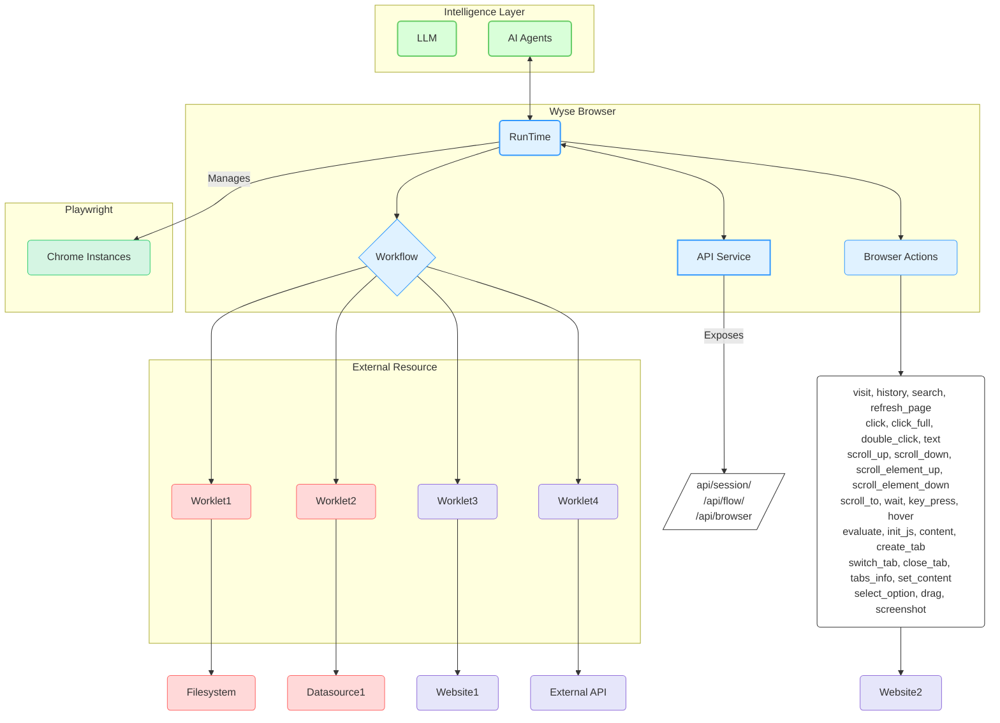

# Wyse Browser

## Overview

Wyse Browser is a powerful, multi-process runtime engine designed for executing automated flows within a browser environment.

## Architecture

The Wyse Browser protocol is built for distributed systems, enabling each engine to manage multiple workflow and worklet instances efficiently.



## Browser Action Space

The `BrowserAction` module provides a comprehensive set of low-level actions that can be executed on a page within a session. These actions are the fundamental building blocks for creating complex automation flows.

| Action | Description | Parameters |
| :--- | :--- | :--- |
| `url` | Gets the URL of the current page. | _None_ |
| `visit` | Navigates the page to a specified URL. | `url`: The URL to visit. |
| `history` | Navigates forward or backward in the browser history. | `num`: A positive number to go forward, a negative number to go back. |
| `search` | Performs a Google search. | `search_key`: The text to search for. |
| `refreshpage` | Reloads the current page. | _None_ |
| `click` | Clicks an element or a point on the page. | `element_id` or (`x`, `y` coordinates). |
| `clickfull` | A more comprehensive click action. | `element_id` or (`x`, `y` coordinates). Optional: `hold` (seconds), `button` ("left", "right", "middle"). |
| `doubleclick` | Double-clicks an element or a point on the page. | `element_id` or (`x`, `y` coordinates). |
| `text` | Enters text into an element or at the current cursor position. | `text`: The text to type. Optional: `element_id`, `press_enter` (boolean), `delete_existing_text` (boolean), or (`x`, `y` coordinates). |
| `scrollup` | Scrolls the page up. | _None_ |
| `scrolldown` | Scrolls the page down. | _None_ |
| `scrollelementup` | Scrolls an element's container up. | `element_id`, `page_number`: Number of pages to scroll. |
| `scrollelementdown` | Scrolls an element's container down. | `element_id`, `page_number`: Number of pages to scroll. |
| `scrollto` | Scrolls to make an element visible. | `element_id`: The ID of the element to scroll to. |
| `wait` | Pauses execution for a specified duration. | `time`: The number of seconds to wait. |
| `keypress` | Simulates key presses. | `keys`: A string or array of strings of keys to press (e.g., 'Enter', 'Control+A'). |
| `hover` | Hovers over an element or a point on the page. | `element_id` or (`x`, `y` coordinates). |
| `evaluate` | Executes a JavaScript snippet in the page context. | `script`: The JavaScript code to execute. |
| `initjs` | Injects initialization JavaScript into the page. | _None_ |
| `waitforloadstate` | Waits for the page to reach a specific load state. | _None_ |
| `content` | Gets the full HTML content of the page. | _None_ |
| `createtab` | Creates a new browser tab. | Optional: `url`: The URL to open in the new tab. |
| `switchtab` | Switches to a different tab. | `tab_index`: The index of the tab to switch to. |
| `closetab` | Closes a browser tab. | `tab_index`: The index of the tab to close. |
| `tabsinfo` | Retrieves information about all open tabs. | _None_ |
| `cleanupanimations` | Removes animations from the page to stabilize tests. | _None_ |
| `previewaction` | Highlights an element to preview an action without executing it. | `element_id`: The ID of the element to preview. |
| `setcontent` | Sets the HTML content of the page. | `content`: The HTML content to set. |
| `ensurepageready` | Ensures the page is fully loaded and ready for interaction. | _None_ |
| `selectoption` | Selects an option from a dropdown or custom select component. | `element_id` or (`x`, `y` coordinates). |
| `drag` | Performs a drag-and-drop operation. | `drag_path`: A JSON string or array of points `{x, y}` representing the drag path. |
| `screenshot` | Takes a screenshot of the current page. | _None_ |

## API Endpoints

The Wyse Browser exposes a rich set of API endpoints for programmatic control over browser automation tasks.

### Base URL

```
http://127.0.0.1:13100
```

### Health Check

| Method | Endpoint | Description | Parameters |
| :--- | :--- | :--- | :--- |
| `GET` | `/api/health` | Checks if the API server is running. | _None_ |

### Metadata Management

| Method | Endpoint | Description | Parameters |
| :--- | :--- | :--- | :--- |
| `GET` | `/api/metadata/flow/:name` | Retrieves the manifest for a specific flow. | **Path**: `name` (string, required) |
| `GET` | `/api/metadata/worklet/:name` | Retrieves the manifest for a specific worklet. | **Path**: `name` (string, required) |
| `GET` | `/api/metadata/list/:type` | Lists all available metadata for a given type (`flow` or `worklet`). | **Path**: `type` (string, required) - `flow` or `worklet` |
| `POST` | `/api/metadata/save` | Saves or updates a flow manifest. | **Body**: `UpdateMetadataDto`<br>- `metadata_type` (string, required)<br>- `name` (string, required)<br>- `data` (object, required) |

### Session Management

| Method | Endpoint | Description | Parameters |
| :--- | :--- | :--- | :--- |
| `POST` | `/api/session/create` | Creates a new browser session. | **Body**: `CreateSessionDto`<br>- `session_context` (object, optional)<br>- `session_id` (string, optional) |
| `POST` | `/api/session/:sessionId/add_init_script` | Adds an initialization script to the session. | **Path**: `sessionId` (string, required)<br>**Body**: `AddInitScriptDto`<br>- `script` (string, required) |
| `GET` | `/api/session/:sessionId` | Retrieves details for a specific session. | **Path**: `sessionId` (string, required) |
| `GET` | `/api/session/:sessionId/context` | Gets the context (cookies, local storage) of a session. | **Path**: `sessionId` (string, required) |
| `GET` | `/api/session/:sessionId/release` | Closes and cleans up a session. | **Path**: `sessionId` (string, required) |
| `GET` | `/api/sessions/list` | Lists all active sessions. | _None_ |
| `GET` | `/api/session/:sessionId/screenshot` | Takes a screenshot of the current page in a session. | **Path**: `sessionId` (string, required) |

### Browser Actions

| Method | Endpoint | Description | Parameters |
| :--- | :--- | :--- | :--- |
| `POST` | `/api/browser/action` | Executes a single browser action (e.g., `click`, `text`). | **Body**: `BrowserActionDto`<br>- `session_id` (string, required)<br>- `page_id` (number, optional, default: 0)<br>- `action_name` (string, required)<br>- `data` (object, required) |
| `POST` | `/api/browser/batch_actions` | Executes a batch of browser actions sequentially. | **Body**: `BatchActionsDto`<br>- `session_id` (string, required)<br>- `page_id` (number, optional, default: 0)<br>- `actions` (array, required):<br>  - `action_name` (string, required)<br>  - `data` (object, required) |

### Page Management

| Method | Endpoint | Description | Parameters |
| :--- | :--- | :--- | :--- |
| `POST` | `/api/session/:sessionId/page/create` | Creates a new page (tab) in a session. | **Path**: `sessionId` (string, required) |
| `GET` | `/api/session/:sessionId/page/:pageId/switch` | Switches the active page in a session. | **Path**:<br>- `sessionId` (string, required)<br>- `pageId` (number, required) |
| `GET` | `/api/session/:sessionId/page/:pageId/release` | Closes a specific page in a session. | **Path**:<br>- `sessionId` (string, required)<br>- `pageId` (number, required) |

### Flow Management

| Method | Endpoint | Description | Parameters |
| :--- | :--- | :--- | :--- |
| `POST` | `/api/flow/create` | Creates a new flow instance from a predefined manifest. | **Body**: `CreateFlowDto`<br>- `flow_name` (string, required)<br>- `session_id` (string, optional)<br>- `is_save_video` (boolean, optional)<br>- `extension_names` (string[], optional) |
| `POST` | `/api/flow/deploy` | Deploys a new flow using an inline JSON definition. | **Body**: `DeployFlowDto`<br>- `flow` (object, required)<br>- `session_id` (string, optional)<br>- `is_save_video` (boolean, optional)<br>- `extension_names` (string[], optional) |
| `POST` | `/api/flow/fire` | Executes an action within a running flow instance. | **Body**: `FireFlowDto`<br>- `flow_instance_id` (string, required)<br>- `action_name` (string, optional, default: `action_flow_start`)<br>- `data` (object, required) |
| `GET` | `/api/flow/list` | Lists all active flow instances. | _None_ |


## Work Flow

### Runtime

The **Runtime** provides an execution environment tailored for running flows in a multi-process mode. It features a flexible architecture for effective management and execution of both Worklets and Workflows.

It acts as the central coordinator, responsible for:

-   Managing multiple workflow and worklet instances.
-   Controlling client connection permissions and lifecycles.
-   Enforcing security policies and consent requirements.
-   Tracking progress and status of executions.

### Workflow

A **Workflow** defines a precise sequence of worklets executed in a specific order. Workflows are designed and created by AI agents and maintain isolated data connections within the Wyse Browser. Developers can establish bi-directional data communication through the Inter-Worklet Communication (IWC) protocol by arranging worklets and connections within a flow.

### Worklet

A **Worklet** is a reusable, autonomous, and highly composable code block dedicated to performing a specific task. Worklets expose resources and tools, operating independently with focused responsibilities. They can be implemented in various programming languages and function as either local processes or remote services.


## Security and Safety

Security and user safety are paramount in Wyse Browser:

1.  **User Consent and Control**:
    *   Users must explicitly consent to and fully understand all data access and operations.
    *   Users must retain absolute control over data sharing and actions taken on their behalf.
    *   The Wyse Browser is designed to provide clear user interfaces and logs for comprehensive review and auditing of all activities.

2.  **Data Privacy**:
    *   Applications must obtain explicit user consent before exposing any user data to external servers.
    *   Applications are strictly prohibited from transmitting resource data elsewhere without explicit user consent.
    *   User data is protected with appropriate access controls to ensure confidentiality and integrity.

3.  **Worklet Safety**:
    *   Worklets involve arbitrary code execution and must be handled with extreme caution.
    *   Hosts must obtain explicit user consent before invoking any worklet.
    *   Users should have a clear understanding of each worklet's functionality before authorizing its use.

## License

This project is licensed under the MIT License. See the [LICENSE](LICENSE) file for details.