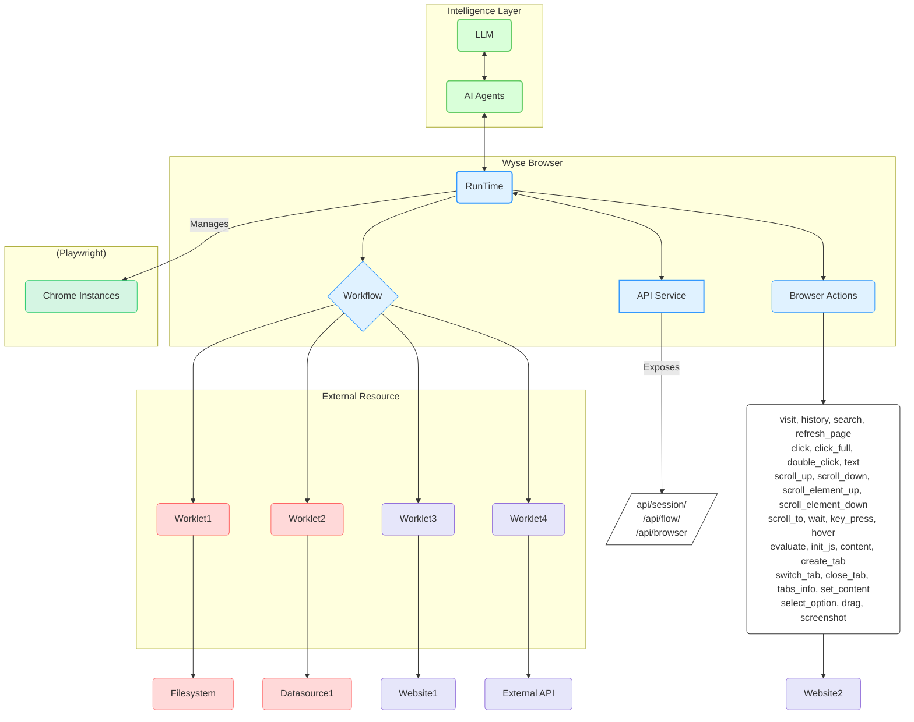

# Wyse Browser

[English](README.md) [简体中文](README_zh-CN.md)

[](https://github.com/wyse-work/wyse-browser)
[](https://opensource.org/licenses/MIT)
[](CONTRIBUTING.md)

Wyse Browser is a powerful, multi-process runtime engine designed for executing automated flows within a browser environment. It provides a robust platform for creating, managing, and executing complex automation workflows through a comprehensive REST API.

## Key Features

-   **Powerful Automation Core**: Built on NestJS and Playwright for reliable and efficient browser automation.
-   **Modular & Extensible**: Use Worklets as reusable components to build complex Workflows.
-   **Full API Control**: A comprehensive REST API for programmatic control over sessions, pages, flows, and actions.
-   **Parallel Execution**: Manages multiple sandboxed Chrome instances to run tasks in parallel.
-   **Rich Action Space**: A wide range of built-in browser actions, from navigation and clicking to executing custom JavaScript.

## Architecture

The Wyse Browser protocol is built for distributed systems, enabling each engine to manage multiple workflow and worklet instances efficiently.



## Getting Started

### Prerequisites

- Node.js (v20.x or later)
- pnpm

### Installation

1.  Clone the repository:
    ```bash
    git clone https://github.com/wyse-work/wyse-browser.git
    cd wyse-browser
    ```

2.  Navigate to the browser engine directory and install dependencies:
    ```bash
    cd browser
    pnpm install
    ```

3.  Build all worklets:
    ```bash
    ./build_worklets.sh
    ```

4.  Run the API development server:
    ```bash
    pnpm run start:dev
    ```
    The API server will be running at `http://127.0.0.1:13100`.

## Quick Start: Usage Example

Here's a quick example of how to use `curl` to create a session, navigate to a page, and take a screenshot.

1.  **Create a new session:**
    ```bash
    SESSION_ID=$(curl -s -X POST http://127.0.0.1:13100/api/session/create \
    -H "Content-Type: application/json" \
    -d '{}' | grep -o '"session_id":"[^"]*' | cut -d'"' -f4)

    echo "Session created with ID: $SESSION_ID"
    ```

2.  **Perform a "visit" action:**
    ```bash
    curl -X POST http://127.0.0.1:13100/api/browser/action \
    -H "Content-Type: application/json" \
    -d '{
      "session_id": "'"$SESSION_ID"'",
      "action_name": "visit",
      "data": { "url": "https://www.google.com" }
    }'
    ```

3.  **Take a screenshot:**
    ```bash
    curl -X GET http://127.0.0.1:13100/api/session/$SESSION_ID/screenshot
    ```

## API Reference

The Wyse Browser exposes a rich set of API endpoints for programmatic control.

### Base URL
`http://127.0.0.1:13100`

*For detailed information on all endpoints, parameters, and responses, please see the [API Documentation in `browser/README.md`](./browser/README.md#api-endpoints).*

## Core Concepts

-   **Workflow**: Defines a precise sequence of worklets executed in a specific order. Workflows are designed and created by AI agents and maintain isolated data connections within the Wyse Browser.
-   **Worklet**: A reusable, autonomous, and highly composable code block dedicated to performing a specific task. They can be implemented in various languages and function as local processes or remote services.
-   **Browser Actions**: The fundamental building blocks for automation. These are low-level actions that can be executed on a page, such as `click`, `visit`, or `screenshot`.

## Security and Safety

Security and user safety are paramount in Wyse Browser:

1.  **User Consent and Control**: Users must explicitly consent to and fully understand all data access and operations.
2.  **Data Privacy**: Applications must obtain explicit user consent before exposing any user data to external servers.
3.  **Worklet Safety**: Worklets involve arbitrary code execution and must be handled with extreme caution. Hosts must obtain explicit user consent before invoking any worklet.

## Contributing

Contributions are welcome! Please feel free to submit a pull request.

1.  Fork the repository.
2.  Create your feature branch (`git checkout -b feature/AmazingFeature`).
3.  Commit your changes (`git commit -m 'Add some AmazingFeature'`).
4.  Push to the branch (`git push origin feature/AmazingFeature`).
5.  Open a Pull Request.

## License

This project is licensed under the MIT License. See the [LICENSE](LICENSE) file for details.