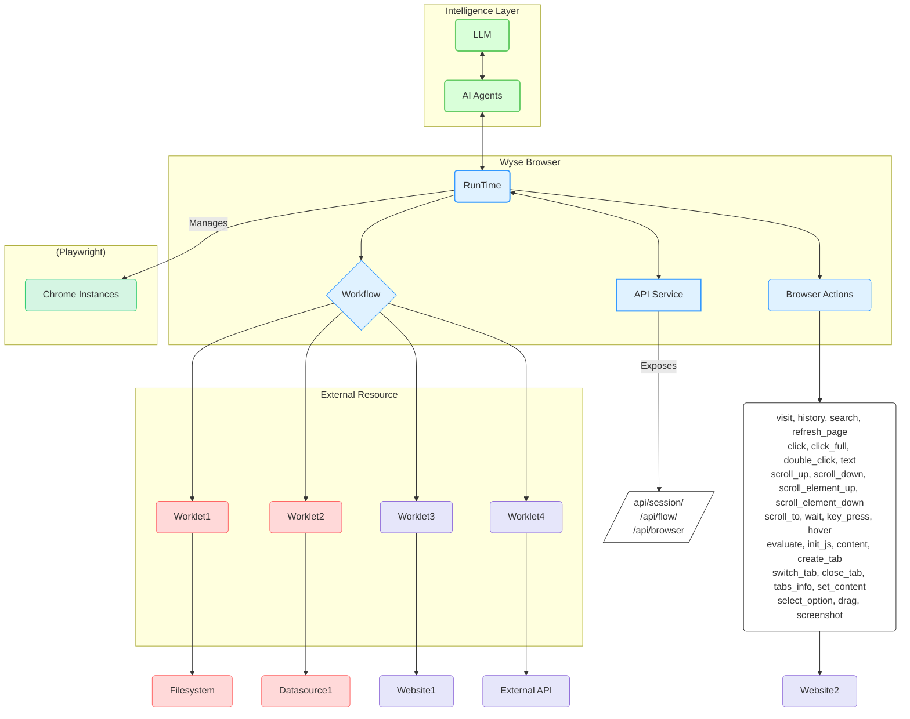

# Wyse Browser 🚀

[English](README.md) [简体中文](README_zh-CN.md)

[](https://github.com/wyse-work/wyse-browser)
[](https://opensource.org/licenses/MIT)
[](CONTRIBUTING.md)

Wyse Browser is a powerful, multi-process runtime engine designed for executing automated flows within a browser environment. It provides a robust platform for creating, managing, and executing complex automation workflows through a comprehensive REST API.

## Key Features 🌟

-   **Powerful & Scalable Automation Core** ✨: Built on NestJS and Playwright, Wyse Browser provides a reliable and efficient multi-process runtime engine. It orchestrates multiple sandboxed Chrome instances, enabling robust and scalable browser automation.
-   **AI-Driven Workflow Orchestration** 🧠: Designed to integrate seamlessly with LLMs and AI Agents, facilitating the creation, management, and execution of sophisticated, AI-driven automation workflows.
-   **Modular & Extensible Worklets** 🧩: Leverage Worklets as autonomous, reusable, and highly composable code blocks for specific tasks, allowing for flexible and extensible automation solutions.
-   **Comprehensive REST API Control** 🔗: Offers a full-featured REST API for programmatic control over every aspect of the browser environment, including sessions, pages, flows, and individual browser actions.
-   **Parallel & Isolated Session Execution** ⚡: Manages multiple independent browser sessions in parallel, each running in a sandboxed Chrome instance with isolated contexts (cookies, local storage), ensuring tasks run without interference.
-   **Rich & Granular Action Space** 🤖: Provides a wide array of built-in, low-level browser actions—from navigation and clicking to executing custom JavaScript—offering precise control over browser interactions.
-   **Robust Security & Data Privacy** 🔒: Prioritizes user safety with explicit consent mechanisms for data access, strong data privacy measures, and secure handling of worklets which involve arbitrary code execution.

## Architecture 🏗️

The Wyse Browser protocol is built for distributed systems, enabling each engine to manage multiple workflow and worklet instances efficiently.



## Core Concepts ✨

-   **Session** 🌐: A dedicated, isolated browser environment (a sandboxed Chrome instance) that provides a consistent context for executing workflows and browser actions. Each session manages its own cookies, local storage, and pages (tabs), ensuring that automated tasks run without interference from other operations.
-   **Browser Actions** 🤖: The fundamental building blocks for automation within a session. These are low-level, atomic operations that can be executed on a browser page, such as `visit` a URL, `click` an element, `type` text, or `take a screenshot`. These actions are exposed through a comprehensive API, allowing for granular control over browser interactions.
-   **Workflow** 🚀: Defines a precise sequence of worklets executed in a specific order. Workflows are designed and created by AI agents to automate complex multi-step tasks within the browser. Each workflow maintains isolated data connections and state, ensuring independent and reliable execution.
-   **Worklet** 🧩: A reusable, autonomous, and highly composable code block dedicated to performing a specific task. Worklets act as the modular units of automation, encapsulating logic for interactions with external resources or complex browser operations. They can be implemented in various languages and function as local processes or remote services, allowing for flexible and extensible automation.


## Getting Started 🏁

### Prerequisites 🛠️

- Node.js (v20.x or later)
- pnpm

### Installation ⬇️

1.  Clone the repository:
    ```bash
    git clone https://github.com/wyse-work/wyse-browser.git
    cd wyse-browser
    ```

2.  Navigate to the browser engine directory and install dependencies:
    ```bash
    cd browser
    pnpm install
    ```

3.  Build all worklets:
    ```bash
    ./build_worklets.sh
    ```

4.  Run the API development server:
    ```bash
    pnpm run start:dev
    ```
    The API server will be running at `http://127.0.0.1:13100`.

## Quick Start: Usage Example ⚡

Here's a quick example of how to use `curl` to create a session, navigate to a page, and take a screenshot.

1.  **Create a new session:**
    ```bash
    SESSION_ID=$(curl -s -X POST http://127.0.0.1:13100/api/session/create \
    -H "Content-Type: application/json" \
    -d '{}' | grep -o '"session_id":"[^"]*' | cut -d'"' -f4)

    echo "Session created with ID: $SESSION_ID"
    ```

2.  **Perform a "visit" action:**
    ```bash
    curl -X POST http://127.0.0.1:13100/api/browser/action \
    -H "Content-Type: application/json" \
    -d '{
      "session_id": "'"$SESSION_ID"'",
      "action_name": "visit",
      "data": { "url": "https://www.google.com" }
    }'
    ```

3.  **Take a screenshot:**
    ```bash
    curl -X GET http://127.0.0.1:13100/api/session/$SESSION_ID/screenshot
    ```

## API Reference 📚

The Wyse Browser exposes a rich set of API endpoints for programmatic control over browser automation tasks.

### Base URL 💖

```
http://127.0.0.1:13100
```

### Health Check

| Method | Endpoint | Description | Parameters |
| :--- | :--- | :--- | :--- |
| `GET` | `/api/health` | Checks if the API server is running. | _None_ |

### Metadata Management 🗃️

| Method | Endpoint | Description | Parameters |
| :--- | :--- | :--- | :--- |
| `GET` | `/api/metadata/flow/:name` | Retrieves the manifest for a specific flow. | **Path**: `name` (string, required) |
| `GET` | `/api/metadata/worklet/:name` | Retrieves the manifest for a specific worklet. | **Path**: `name` (string, required) |
| `GET` | `/api/metadata/list/:type` | Lists all available metadata for a given type (`flow` or `worklet`). | **Path**: `type` (string, required) - `flow` or `worklet` |
| `POST` | `/api/metadata/save` | Saves or updates a flow manifest. | **Body**: `UpdateMetadataDto`<br>- `metadata_type` (string, required)<br>- `name` (string, required)<br>- `data` (object, required) |

### Session Management 📈

| Method | Endpoint | Description | Parameters |
| :--- | :--- | :--- | :--- |
| `POST` | `/api/session/create` | Creates a new browser session. | **Body**: `CreateSessionDto`<br>- `session_context` (object, optional)<br>- `session_id` (string, optional) |
| `POST` | `/api/session/:sessionId/add_init_script` | Adds an initialization script to the session. | **Path**: `sessionId` (string, required)<br>**Body**: `AddInitScriptDto`<br>- `script` (string, required) |
| `GET` | `/api/session/:sessionId` | Retrieves details for a specific session. | **Path**: `sessionId` (string, required) |
| `GET` | `/api/session/:sessionId/context` | Gets the context (cookies, local storage) of a session. | **Path**: `sessionId` (string, required) |
| `GET` | `/api/session/:sessionId/release` | Closes and cleans up a session. | **Path**: `sessionId` (string, required) |
| `GET` | `/api/sessions/list` | Lists all active sessions. | _None_ |
| `GET` | `/api/session/:sessionId/screenshot` | Takes a screenshot of the current page in a session. | **Path**: `sessionId` (string, required) |

### Browser Actions 🎬

| Method | Endpoint | Description | Parameters |
| :--- | :--- | :--- | :--- |
| `POST` | `/api/browser/action` | Executes a single browser action (e.g., `click`, `text`). | **Body**: `BrowserActionDto`<br>- `session_id` (string, required)<br>- `page_id` (number, optional, default: 0)<br>- `action_name` (string, required)<br>- `data` (object, required) |
| `POST` | `/api/browser/batch_actions` | Executes a batch of browser actions sequentially. | **Body**: `BatchActionsDto`<br>- `session_id` (string, required)<br>- `page_id` (number, optional, default: 0)<br>- `actions` (array, required):<br>  - `action_name` (string, required)<br>  - `data` (object, required) |

### Page Management 📄

| Method | Endpoint | Description | Parameters |
| :--- | :--- | :--- | :--- |
| `POST` | `/api/session/:sessionId/page/create` | Creates a new page (tab) in a session. | **Path**: `sessionId` (string, required) |
| `GET` | `/api/session/:sessionId/page/:pageId/switch` | Switches the active page in a session. | **Path**:<br>- `sessionId` (string, required)<br>- `pageId` (number, required) |
| `GET` | `/api/session/:sessionId/page/:pageId/release` | Closes a specific page in a session. | **Path**:<br>- `sessionId` (string, required)<br>- `pageId` (number, required) |

### Flow Management 🌊

| Method | Endpoint | Description | Parameters |
| :--- | :--- | :--- | :--- |
| `POST` | `/api/flow/create` | Creates a new flow instance from a predefined manifest. | **Body**: `CreateFlowDto`<br>- `flow_name` (string, required)<br>- `session_id` (string, optional)<br>- `is_save_video` (boolean, optional)<br>- `extension_names` (string[], optional) |
| `POST` | `/api/flow/deploy` | Deploys a new flow using an inline JSON definition. | **Body**: `DeployFlowDto`<br>- `flow` (object, required)<br>- `session_id` (string, optional)<br>- `is_save_video` (boolean, optional)<br>- `extension_names` (string[], optional) |
| `POST` | `/api/flow/fire` | Executes an action within a running flow instance. | **Body**: `FireFlowDto`<br>- `flow_instance_id` (string, required)<br>- `action_name` (string, optional, default: `action_flow_start`)<br>- `data` (object, required) |
| `GET` | `/api/flow/list` | Lists all active flow instances. | _None_ |

### File Management 📁

| Method | Endpoint | Description | Parameters |
| :--- | :--- | :--- | :--- |
| `POST` | `/api/sessions/:sessionId/files` | Uploads one or more files to a session, checking against session storage limits. | **Path**: `sessionId` (string, required)<br>**Body**: `filePath` (string, optional) - target path for the file, defaults to original name. |
| `GET` | `/api/sessions/:sessionId/files` | Lists all files stored within a specific session. | **Path**: `sessionId` (string, required) |
| `GET` | `/api/sessions/:sessionId/files/*` | Downloads a specific file from a session. | **Path**:<br>- `sessionId` (string, required)<br>- `filePath` (string, required) |
| `HEAD` | `/api/sessions/:sessionId/files/*` | Retrieves metadata (headers) for a specific file in a session without downloading the content. | **Path**:<br>- `sessionId` (string, required)<br>- `filePath` (string, required) |
| `GET` | `/api/sessions/:sessionId/files.zip` | Downloads all files from a session as a ZIP archive. | **Path**: `sessionId` (string, required) |
| `DELETE` | `/api/sessions/:sessionId/files/*` | Deletes a specific file from a session. | **Path**:<br>- `sessionId` (string, required)<br>- `filePath` (string, required) |
| `DELETE` | `/api/sessions/:sessionId/files` | Deletes all files associated with a specific session. | **Path**: `sessionId` (string, required) |

## Action Space 🚀

The `BrowserAction` module provides a comprehensive set of low-level actions that can be executed on a page within a session. These actions are the fundamental building blocks for creating complex automation flows.

| Action | Description | Parameters |
| :--- | :--- | :--- |
| `url` | Gets the URL of the current page. | _None_ |
| `visit` | Navigates the page to a specified URL. | `url`: The URL to visit. |
| `history` | Navigates forward or backward in the browser history. | `num`: A positive number to go forward, a negative number to go back. |
| `search` | Performs a Google search. | `search_key`: The text to search for. |
| `refreshpage` | Reloads the current page. | _None_ |
| `click` | Clicks an element or a point on the page. | `element_id` or (`x`, `y` coordinates). |
| `clickfull` | A more comprehensive click action. | `element_id` or (`x`, `y` coordinates). Optional: `hold` (seconds), `button` ("left", "right", "middle"). |
| `doubleclick` | Double-clicks an element or a point on the page. | `element_id` or (`x`, `y` coordinates). |
| `text` | Enters text into an element or at the current cursor position. | `text`: The text to type. Optional: `element_id`, `press_enter` (boolean), `delete_existing_text` (boolean), or (`x`, `y` coordinates). |
| `scrollup` | Scrolls the page up. | _None_ |
| `scrolldown` | Scrolls the page down. | _None_ |
| `scrollelementup` | Scrolls an element\'s container up. | `element_id`, `page_number`: Number of pages to scroll. |
| `scrollelementdown` | Scrolls an element\'s container down. | `element_id`, `page_number`: Number of pages to scroll. |
| `scrollto` | Scrolls to make an element visible. | `element_id`: The ID of the element to scroll to. |
| `wait` | Pauses execution for a specified duration. | `time`: The number of seconds to wait. |
| `keypress` | Simulates key presses. | `keys`: A string or array of strings of keys to press (e.g., \'Enter\', \'Control+A\'). |
| `hover` | Hovers over an element or a point on the page. | `element_id` or (`x`, `y` coordinates). |
| `evaluate` | Executes a JavaScript snippet in the page context. | `script`: The JavaScript code to execute. |
| `initjs` | Injects initialization JavaScript into the page. | _None_ |
| `waitforloadstate` | Waits for the page to reach a specific load state. | _None_ |
| `content` | Gets the full HTML content of the page. | _None_ |
| `createtab` | Creates a new browser tab. | Optional: `url`: The URL to open in the new tab. |
| `switchtab` | Switches to a different tab. | `tab_index`: The index of the tab to switch to. |
| `closetab` | Closes a browser tab. | `tab_index`: The index of the tab to close. |
| `tabsinfo` | Retrieves information about all open tabs. | _None_ |
| `cleanupanimations` | Removes animations from the page to stabilize tests. | _None_ |
| `previewaction` | Highlights an element to preview an action without executing it. | `element_id`: The ID of the element to preview. |
| `setcontent` | Sets the HTML content of the page. | `content`: The HTML content to set. |
| `ensurepageready` | Ensures the page is fully loaded and ready for interaction. | _None_ |
| `selectoption` | Selects an option from a dropdown or custom select component. | `element_id` or (`x`, `y` coordinates). |
| `drag` | Performs a drag-and-drop operation. | `drag_path`: A JSON string or array of points `{x, y}` representing the drag path. |
| `screenshot` | Takes a screenshot of the current page. | _None_ |


## Security and Safety 🔒

Security and user safety are paramount in Wyse Browser:

1.  **User Consent and Control**: Users must explicitly consent to and fully understand all data access and operations.
2.  **Data Privacy**: Applications must obtain explicit user consent before exposing any user data to external servers.
3.  **Worklet Safety**: Worklets involve arbitrary code execution and must be handled with extreme caution. Hosts must obtain explicit user consent before invoking any worklet.

## Contributing 🤝

Contributions are welcome! Please feel free to submit a pull request.

1.  Fork the repository.
2.  Create your feature branch (`git checkout -b feature/AmazingFeature`).
3.  Commit your changes (`git commit -m 'Add some AmazingFeature'`).
4.  Push to the branch (`git push origin feature/AmazingFeature`).
5.  Open a Pull Request.

## License 📄

This project is licensed under the MIT License. See the [LICENSE](LICENSE) file for details.