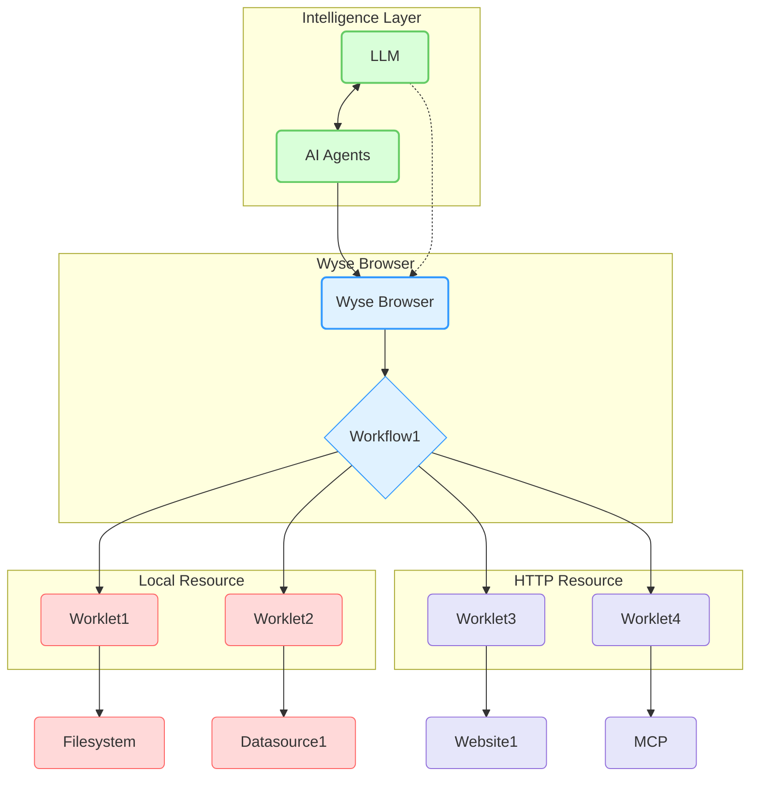

# Wyse Browser

## Overview

Wyse Browser is a powerful, multi-process runtime engine designed for executing automated flows within a browser environment.

## Architecture

The Wyse Browser protocol is built for distributed systems, enabling each engine to manage multiple workflow and worklet instances efficiently.

### Wyse Browser

The **Wyse Browser** acts as the central coordinator, responsible for:

-   Managing multiple workflow and worklet instances.
-   Controlling client connection permissions and lifecycles.
-   Enforcing security policies and consent requirements.
-   Tracking progress and status of executions.

### Workflow

A **Workflow** defines a precise sequence of worklets executed in a specific order. Workflows are designed and created by AI agents and maintain isolated data connections within the Wyse Browser. Developers can establish bi-directional data communication through the Inter-Worklet Communication (IWC) protocol by arranging worklets and connections within a flow.

### Worklet

A **Worklet** is a reusable, autonomous, and highly composable code block dedicated to performing a specific task. Worklets expose resources and tools, operating independently with focused responsibilities. They can be implemented in various programming languages and function as either local processes or remote services.

### Runtime

The **Runtime** provides an execution environment tailored for running flows in a multi-process mode. It features a flexible architecture for effective management and execution of both Worklets and Workflows.

### Actions

**Actions** are the fundamental code blocks that are executed by Worklets, representing the discrete operations performed.

## Security and Safety

Security and user safety are paramount in Wyse Browser:

1.  **User Consent and Control**:
    *   Users must explicitly consent to and fully understand all data access and operations.
    *   Users must retain absolute control over data sharing and actions taken on their behalf.
    *   The Wyse Browser is designed to provide clear user interfaces and logs for comprehensive review and auditing of all activities.

2.  **Data Privacy**:
    *   Applications must obtain explicit user consent before exposing any user data to external servers.
    *   Applications are strictly prohibited from transmitting resource data elsewhere without explicit user consent.
    *   User data is protected with appropriate access controls to ensure confidentiality and integrity.

3.  **Worklet Safety**:
    *   Worklets involve arbitrary code execution and must be handled with extreme caution.
    *   Hosts must obtain explicit user consent before invoking any worklet.
    *   Users should have a clear understanding of each worklet's functionality before authorizing its use.

## License

This project is licensed under the MIT License. See the [LICENSE](LICENSE) file for details.
