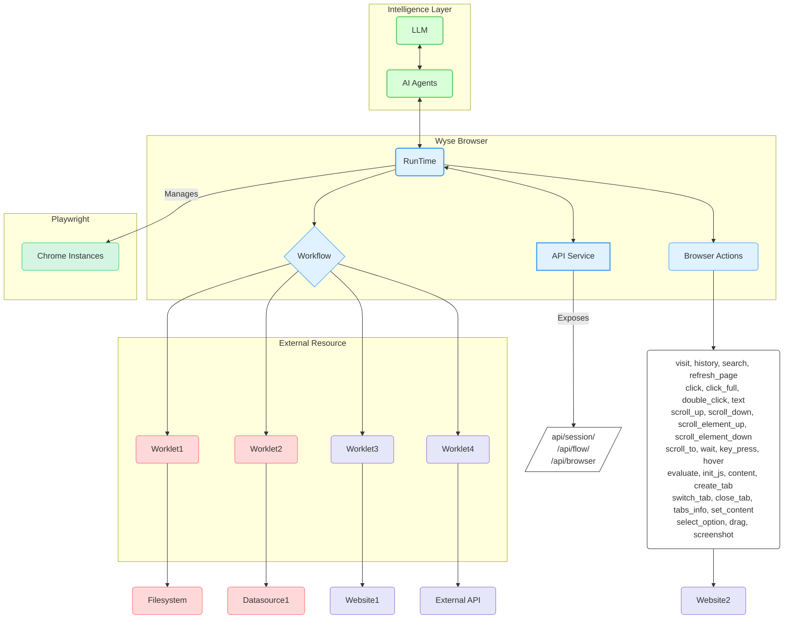

# Wyse 浏览器 🚀

[English](README.md) [简体中文](README_zh-CN.md)

[](https://github.com/wyse-work/wyse-browser)
[](https://opensource.org/licenses/Apache-2.0)
[](CONTRIBUTING.md)

Wyse Browser 是一个功能强大的多进程运行时引擎，专为在浏览器环境中执行自动化流程而设计。它提供了一个强大的平台，通过全面的 REST API，用于创建、管理和执行复杂的自动化工作流。

## 主要特性 🌟

-   **强大且可扩展的自动化核心** ✨：Wyse Browser 基于 NestJS 和 Playwright 构建，提供可靠高效的多进程运行时引擎。它协调多个沙盒化的 Chrome 实例，实现强大且可扩展的浏览器自动化。
-   **AI 驱动的工作流编排** 🧠：旨在与 LLM 和 AI 代理无缝集成，促进复杂、AI 驱动的自动化工作流的创建、管理和执行。
-   **模块化和可扩展的工作单元** 🧩：利用工作单元作为自主、可重用且高度可组合的代码块来执行特定任务，从而实现灵活和可扩展的自动化解决方案。
-   **全面的 REST API 控制** 🔗：提供全功能的 REST API，用于以编程方式控制浏览器环境的各个方面，包括会话、页面、流程和单个浏览器操作。
-   **并行和隔离的会话执行** ⚡：并行管理多个独立的浏览器会话，每个会话都在沙盒化的 Chrome 实例中运行，具有独立的上下文（cookies、本地存储），确保任务在不受干扰的情况下运行。
-   **丰富细致的操作空间** 🤖：提供广泛的内置低级浏览器操作——从导航和点击到执行自定义 JavaScript——对浏览器交互提供精确控制。
-   **强大的安全和数据隐私** 🔒：通过数据访问的明确同意机制、强大的数据隐私措施以及涉及任意代码执行的工作单元的安全处理，优先考虑用户安全。

## 架构 🏗️

Wyse 浏览器协议专为分布式系统构建，使每个引擎能够高效管理多个工作流和工作单元实例。



## 核心概念 ✨

-   **会话 (Session)** 🌐：一个专用、隔离的浏览器环境（沙盒化的 Chrome 实例），为执行工作流和浏览器操作提供一致的上下文。每个会话管理自己的 cookie、本地存储和页面（选项卡），确保自动化任务在不受其他操作干扰的情况下运行。
-   **浏览器操作 (Browser Actions)** 🤖：会话中自动化的基本构建块。这些是可以在浏览器页面上执行的低级原子操作，例如 `visit` 一个 URL、`click` 一个元素、`type` 文本或 `take a screenshot`。这些操作通过全面的 API 暴露，允许对浏览器交互进行精细控制。
-   **工作流 (Workflow)** 🚀：定义按特定顺序执行工作单元的精确序列。工作流由 AI 代理设计和创建，用于自动化浏览器中复杂的多个步骤任务。每个工作流都维护独立的数据库连接和状态，确保独立可靠的执行。
-   **工作单元 (Worklet)** 🧩：一个可重用、自主且高度可组合的代码块，专用于执行特定任务。工作单元充当自动化的模块化单元，封装了与外部资源交互或复杂浏览器操作的逻辑。它们可以用各种语言实现，并可作为本地进程或远程服务运行，从而实现灵活和可扩展的自动化。

## 开始使用 🏁

### 前提条件 🛠️

- Node.js (v20.x 或更高版本)
- pnpm

### 安装 ⬇️

1.  克隆仓库：
    ```bash
    git clone https://github.com/wyse-work/wyse-browser.git
    cd wyse-browser
    ```

2.  进入浏览器引擎目录并安装依赖：
    ```bash
    cd browser
    pnpm install
    ```

3.  构建所有 Worklet：
    ```bash
    ./build_worklets.sh
    ```

4.  运行 API 开发服务器：
    ```bash
    pnpm run start:dev
    ```
    API 服务器将在 `http://127.0.0.1:13100` 运行。

## 快速入门：使用示例 ⚡

这是一个使用 `curl` 创建会话、导航页面和截图的快速示例。

1.  **创建一个新会话：**
    ```bash
    SESSION_ID=$(curl -s -X POST http://127.0.0.1:13100/api/session/create \
    -H "Content-Type: application/json" \
    -d '{}' | grep -o '"session_id":"[^"]*' | cut -d'"' -f4)

    echo "会话已创建，ID 为: $SESSION_ID"
    ```

2.  **执行“访问”操作：**
    ```bash
    curl -X POST http://127.0.0.1:13100/api/browser/action \
    -H "Content-Type: application/json" \
    -d '{
      "session_id": "'"$SESSION_ID"'",
      "action_name": "visit",
      "data": { "url": "https://www.google.com" }
    }'
    ```

3.  **进行截图：**
    ```bash
    curl -X GET http://127.0.0.1:13100/api/session/$SESSION_ID/screenshot
    ```

## API 参考 📚

Wyse 浏览器通过丰富的 API 端点提供编程控制浏览器自动化任务的能力。

### 基础 URL

```
http://127.0.0.1:13100
```

### 健康检查 💖

| Method | Endpoint | Description | Parameters |
| :--- | :--- | :--- | :--- |
| `GET` | `/api/health` | 检查 API 服务器是否正在运行。 | _无_ |

### 元数据管理 🗃️

| Method | Endpoint | Description | Parameters |
| :--- | :--- | :--- | :--- |
| `GET` | `/api/metadata/flow/:name` | 检索特定流程的清单。 | **路径**: `name` (字符串, 必填) |
| `GET` | `/api/metadata/worklet/:name` | 检索特定工作单元的清单。 | **路径**: `name` (字符串, 必填) |
| `GET` | `/api/metadata/list/:type` | 列出给定类型（`flow` 或 `worklet`）的所有可用元数据。 | **路径**: `type` (字符串, 必填) - `flow` 或 `worklet` |
| `POST` | `/api/metadata/save` | 保存或更新流程清单。 | **请求体**: `UpdateMetadataDto`<br>- `metadata_type` (字符串, 必填)<br>- `name` (字符串, 必填)<br>- `data` (对象, 必填) |

### 会话管理 📈

| Method | Endpoint | Description | Parameters |
| :--- | :--- | :--- | :--- |
| `POST` | `/api/session/create` | 创建新的浏览器会话。 | **请求体**: `CreateSessionDto`<br>- `session_context` (对象, 可选)<br>- `session_id` (字符串, 可选) |
| `POST` | `/api/session/:sessionId/add_init_script` | 向会话添加初始化脚本。 | **路径**: `sessionId` (字符串, 必填)<br>**请求体**: `AddInitScriptDto`<br>- `script` (字符串, 必填) |
| `GET` | `/api/session/:sessionId` | 检索特定会话的详细信息。 | **路径**: `sessionId` (字符串, 必填) |
| `GET` | `/api/session/:sessionId/context` | 获取会话的上下文（cookies、本地存储）。 | **路径**: `sessionId` (字符串, 必填) |
| `GET` | `/api/session/:sessionId/release` | 关闭并清理会话。 | **路径**: `sessionId` (字符串, 必填) |
| `GET` | `/api/sessions/list` | 列出所有活动会话。 | _无_ |
| `GET` | `/api/session/:sessionId/screenshot` | 在会话中截取当前页面的屏幕截图。 | **路径**: `sessionId` (字符串, 必填) |

### 浏览器操作 🎬

| Method | Endpoint | Description | Parameters |
| :--- | :--- | :--- | :--- |
| `POST` | `/api/browser/action` | 执行单个浏览器操作（例如，`click`，`text`）。 | **请求体**: `BrowserActionDto`<br>- `session_id` (字符串, 必填)<br>- `page_id` (数字, 可选, 默认: 0)<br>- `action_name` (字符串, 必填)<br>- `data` (对象, 必填) |
| `POST` | `/api/browser/batch_actions` | 顺序执行一批浏览器操作。 | **请求体**: `BatchActionsDto`<br>- `session_id` (字符串, 必填)<br>- `page_id` (数字, 可选, 默认: 0)<br>- `actions` (数组, 必填):<br>  - `action_name` (字符串, 必填)<br>  - `data` (对象, 必填) |

### 页面管理 📄

| Method | Endpoint | Description | Parameters |
| :--- | :--- | :--- | :--- |
| `POST` | `/api/session/:sessionId/page/create` | 在会话中创建新页面（选项卡）。 | **路径**: `sessionId` (字符串, 必填) |
| `GET` | `/api/session/:sessionId/page/:pageId/switch` | 切换会话中的活动页面。 | **路径**:<br>- `sessionId` (字符串, 必填)<br>- `pageId` (数字, 必填) |
| `GET` | `/api/session/:sessionId/page/:pageId/release` | 关闭会话中的特定页面。 | **路径**:<br>- `sessionId` (字符串, 必填)<br>- `pageId` (数字, 必填) |

### 流程管理 🌊

| Method | Endpoint | Description | Parameters |
| :--- | :--- | :--- | :--- |
| `POST` | `/api/flow/create` | 从预定义的清单创建新的流程实例。 | **请求体**: `CreateFlowDto`<br>- `flow_name` (字符串, 必填)<br>- `session_id` (字符串, 可选)<br>- `is_save_video` (布尔值, 可选)<br>- `extension_names` (字符串数组, 可选) |
| `POST` | `/api/flow/deploy` | 使用内联 JSON 定义部署新流程。 | **请求体**: `DeployFlowDto`<br>- `flow` (对象, 必填)<br>- `session_id` (字符串, 可选)<br>- `is_save_video` (布尔值, 可选)<br>- `extension_names` (字符串数组, 可选) |
| `POST` | `/api/flow/fire` | 在运行中的流程实例中执行操作。 | **请求体**: `FireFlowDto`<br>- `flow_instance_id` (字符串, 必填)<br>- `action_name` (字符串, 可选, 默认: `action_flow_start`)<br>- `data` (对象, 必填) |
| `GET` | `/api/flow/list` | 列出所有活动的流程实例。 | _无_ |

### 文件管理 📁

| Method | Endpoint | Description | Parameters |
| :--- | :--- | :--- | :--- |
| `POST` | `/api/sessions/:sessionId/files` | 上传一个或多个文件到会话的OSS存储空间，并检查会话存储限制。 | **路径**: `sessionId` (字符串, 必填)<br>**请求体**: `filePath` (字符串, 可选) - 文件的目标路径，默认为原始文件名。 |
| `GET` | `/api/sessions/:sessionId/files` | 列出特定会话中存储在OSS的所有文件，包括浏览器自动下载的文件。 | **路径**: `sessionId` (字符串, 必填) |
| `GET` | `/api/sessions/:sessionId/files/*` | 从OSS下载会话的特定文件。 | **路径**:<br>- `sessionId` (字符串, 必填)<br>- `filePath` (字符串, 必填) |
| `HEAD` | `/api/sessions/:sessionId/files/*` | 检索OSS中特定文件的元数据（标头），而不下载内容。 | **路径**:<br>- `sessionId` (字符串, 必填)<br>- `filePath` (字符串, 必填) |
| `DELETE` | `/api/sessions/:sessionId/files/*` | 从OSS中删除会话的特定文件。 | **路径**:<br>- `sessionId` (字符串, 必填)<br>- `filePath` (字符串, 必填) |
| `DELETE` | `/api/sessions/:sessionId/files` | 删除与特定会话关联的OSS中的所有文件。 | **路径**: `sessionId` (字符串, 必填) |

**文件存储说明**：
- 浏览器下载的文件会自动流式上传到阿里云OSS，无本地存储
- 所有文件通过OSS路径前缀实现会话级别隔离 (`sessions/{sessionId}/`)
- 支持通过CDN公网地址直接访问文件
- 文件名采用UUID格式，确保唯一性和安全性

## 操作空间 🚀

`BrowserAction` 模块提供了一套全面的低级操作，可在会话中的页面上执行。这些操作是创建复杂自动化流程的基本构建块。

| Action | Description | Parameters |
| :--- | :--- | :--- |
| `url` | 获取当前页面的 URL。 | _无_ |
| `visit` | 将页面导航到指定的 URL。 | `url`: 要访问的 URL。 |
| `history` | 在浏览器历史记录中向前或向后导航。 | `num`: 正数表示前进，负数表示后退。 |
| `search` | 执行 Google 搜索。 | `search_key`: 要搜索的文本。 |
| `refreshpage` | 重新加载当前页面。 | _无_ |
| `click` | 点击页面上的元素或坐标。 | `element_id` 或 (`x`, `y` 坐标)。 |
| `clickfull` | 更全面的点击操作。 | `element_id` 或 (`x`, `y` 坐标)。可选: `hold` (秒), `button` ("left", "right", "middle")。 |
| `doubleclick` | 双击页面上的元素或坐标。 | `element_id` 或 (`x`, `y` 坐标)。 |
| `text` | 在元素中或当前光标位置输入文本。 | `text`: 要输入的文本。可选: `element_id`, `press_enter` (布尔值), `delete_existing_text` (布尔值), 或 (`x`, `y` 坐标)。 |
| `scrollup` | 向上滚动页面。 | _无_ |
| `scrolldown` | 向下滚动页面。 | _无_ |
| `scrollelementup` | 向上滚动元素的容器。 | `element_id`, `page_number`: 滚动页数。 |
| `scrollelementdown` | 向下滚动元素的容器。 | `element_id`, `page_number`: 滚动页数。 |
| `scrollto` | 滚动使元素可见。 | `element_id`: 要滚动到的元素 ID。 |
| `wait` | 暂停执行指定持续时间。 | `time`: 等待的秒数。 |
| `keypress` | 模拟按键。 | `keys`: 要按下的键的字符串或字符串数组（例如，'Enter'，'Control+A'）。 |
| `hover` | 悬停在页面上的元素或坐标上。 | `element_id` 或 (`x`, `y` 坐标)。 |
| `evaluate` | 在页面上下文中执行 JavaScript 片段。 | `script`: 要执行的 JavaScript 代码。 |
| `initjs` | 将初始化 JavaScript 注入页面。 | _无_ |
| `waitforloadstate` | 等待页面达到特定的加载状态。 | _无_ |
| `content` | 获取页面的完整 HTML 内容。 | _无_ |
| `createtab` | 创建新的浏览器选项卡。 | 可选: `url`: 要在新选项卡中打开的 URL。 |
| `switchtab` | 切换到不同的选项卡。 | `tab_index`: 要切换到的选项卡索引。 |
| `closetab` | 关闭浏览器选项卡。 | `tab_index`: 要关闭的选项卡索引。 |
| `tabsinfo` | 检索所有打开选项卡的信息。 | _无_ |
| `cleanupanimations` | 从页面中删除动画以稳定测试。 | _无_ |
| `previewaction` | 突出显示元素以预览操作而不执行它。 | `element_id`: 要预览的元素 ID。 |
| `setcontent` | 设置页面的 HTML 内容。 | `content`: 要设置的 HTML 内容。 |
| `ensurepageready` | 确保页面完全加载并准备好进行交互。 | _无_ |
| `selectoption` | 从下拉菜单或自定义选择组件中选择一个选项。 | `element_id` 或 (`x`, `y` 坐标)。 |
| `drag` | 执行拖放操作。 | `drag_path`: 表示拖动路径的 JSON 字符串或点数组 `{x, y}`。 |
| `screenshot` | 截取当前页面的屏幕截图。 | _无_ |

## 安全与保障 🔒

在 Wyse 浏览器中，安全和用户安全至关重要：

1.  **用户同意与控制**：用户必须明确同意并完全理解所有数据访问和操作。
2.  **数据隐私**：应用程序在将任何用户数据暴露给外部服务器之前，必须获得明确的用户同意。
3.  **工作单元安全**：工作单元涉及任意代码执行，必须极其谨慎处理。主机在调用任何工作单元之前，必须获得明确的用户同意。

## 贡献 🤝

欢迎贡献！请随时提交拉取请求。

1.  Fork 仓库。
2.  创建您的功能分支 (`git checkout -b feature/AmazingFeature`)。
3.  提交您的更改 (`git commit -m 'Add some AmazingFeature'`)。
4.  推送到分支 (`git push origin feature/AmazingFeature`)。
5.  打开拉取请求。

