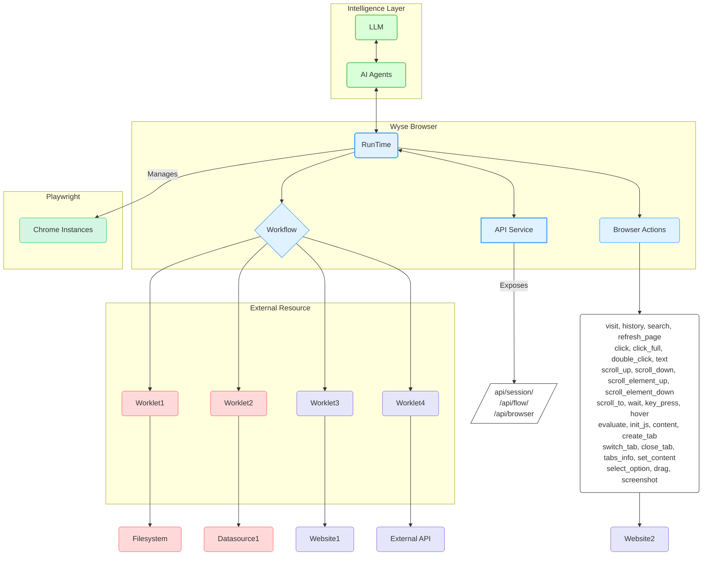

# Wyse 浏览器

[English](README.md) [简体中文](README_zh-CN.md)

[](https://github.com/wyse-work/wyse-browser)
[](https://opensource.org/licenses/MIT)
[](CONTRIBUTING.md)

Wyse Browser是一个多进程运行时引擎，专为在浏览器环境中高效执行智能流程而设计。它提供了一个稳健的平台，通过全面的 REST API，用于创建、管理和执行复杂的智能工作流。

## 主要特性

-   **强大的自动化核心**：基于 NestJS 和 Playwright 构建，确保浏览器自动化稳定可靠。
-   **模块化与可扩展性**：利用可复用的 Worklet 组件，灵活构建复杂的多进程智能流程。
-   **全面的 API 控制**：提供全面的 REST API，实现对会话、页面、流程和操作的全面编程控制。
-   **并行执行**：高效管理多个沙盒化的 Chrome 浏览器实例，任务并行运行，显著提升效率。
-   **丰富的操作空间**：内置20余种浏览器动作，从导航、点击到执行自定义 JavaScript，满足页面精细操作的需求。


## 架构

Wyse 浏览器协议专为分布式系统构建，使每个引擎能够高效管理多个工作流和工作单元实例。



## 开始使用

### 前提条件

- Node.js (v20.x 或更高版本)
- pnpm

### 安装

1.  克隆仓库：
    ```bash
    git clone https://github.com/wyse-work/wyse-browser.git
    cd wyse-browser
    ```

2.  进入浏览器引擎目录并安装依赖：
    ```bash
    cd browser
    pnpm install
    ```

3.  构建所有 Worklet：
    ```bash
    ./build_worklets.sh
    ```

4.  运行 API 开发服务器：
    ```bash
    pnpm run start:dev
    ```
    API 服务器将在 `http://127.0.0.1:13100` 运行。

## 快速入门：使用示例

这是一个使用 `curl` 创建会话、导航页面和截图的快速示例。

1.  **创建一个新会话：**
    ```bash
    SESSION_ID=$(curl -s -X POST http://127.0.0.1:13100/api/session/create \
    -H "Content-Type: application/json" \
    -d '{}' | grep -o '"session_id":"[^"]*' | cut -d'"' -f4)

    echo "会话已创建，ID 为: $SESSION_ID"
    ```

2.  **执行“访问”操作：**
    ```bash
    curl -X POST http://127.0.0.1:13100/api/browser/action \
    -H "Content-Type: application/json" \
    -d '{
      "session_id": "'"$SESSION_ID"'",
      "action_name": "visit",
      "data": { "url": "https://www.google.com" }
    }'
    ```

3.  **进行截图：**
    ```bash
    curl -X GET http://127.0.0.1:13100/api/session/$SESSION_ID/screenshot
    ```

## API 参考

Wyse 浏览器通过丰富的 API 端点提供编程控制。

### 基础 URL
`http://127.0.0.1:13100`

*有关所有端点、参数和响应的详细信息，请参阅 [browser/README.md 中的 API 文档](./browser/README.md#api-endpoints)。*

## 核心概念

-   **工作流 (Workflow)**：定义按特定顺序执行的工作单元的精确序列。工作流由 AI 代理设计和创建，并在 Wyse 浏览器内维护独立的数据库连接。
-   **工作单元 (Worklet)**：一个可复用、自主且高度可组合的代码块，专用于执行特定任务。它们可以用各种编程语言实现，并可作为本地进程或远程服务运行。
-   **浏览器操作 (Browser Actions)**：自动化的基本组成部分。这些是可在页面上执行的低级操作，例如 `click`、`visit` 或 `screenshot`。

## 安全与保障

在 Wyse 浏览器中，安全和用户安全至关重要：

1.  **用户同意与控制**：用户必须明确同意并完全理解所有数据访问和操作。
2.  **数据隐私**：应用程序在将任何用户数据暴露给外部服务器之前，必须获得明确的用户同意。
3.  **工作单元安全**：工作单元涉及任意代码执行，必须极其谨慎处理。主机在调用任何工作单元之前，必须获得明确的用户同意。

## 贡献

欢迎贡献！请随时提交拉取请求。

1.  Fork 仓库。
2.  创建您的功能分支 (`git checkout -b feature/AmazingFeature`)。
3.  提交您的更改 (`git commit -m '添加一些 AmazingFeature'`)。
4.  推送到分支 (`git push origin feature/AmazingFeature`)。
5.  打开拉取请求。

## 许可证

本项目采用 MIT 许可证。有关详细信息，请参阅 [LICENSE](LICENSE) 文件。 