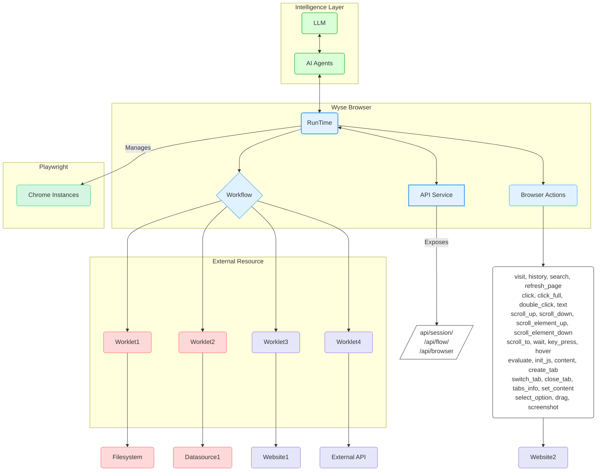

# Wyse 浏览器 🚀

[English](README.md) [简体中文](README_zh-CN.md)

[](https://github.com/wyse-work/wyse-browser)
[](https://opensource.org/licenses/Apache-2.0)
[](CONTRIBUTING.md)

Wyse Browser 是一个功能强大的多进程运行时引擎，专为在浏览器环境中执行自动化流程而设计。它提供了一个强大的平台，通过全面的 REST API，用于创建、管理和执行复杂的自动化工作流。

## 主要特性 🌟

-   **强大且可扩展的自动化核心** ✨：Wyse Browser 基于 NestJS 和 Playwright 构建，提供可靠高效的多进程运行时引擎。它协调多个沙盒化的 Chrome 实例，实现强大且可扩展的浏览器自动化。
-   **AI 驱动的工作流编排** 🧠：旨在与 LLM 和 AI 代理无缝集成，促进复杂、AI 驱动的自动化工作流的创建、管理和执行。
-   **模块化和可扩展的工作单元** 🧩：利用工作单元作为自主、可重用且高度可组合的代码块来执行特定任务，从而实现灵活和可扩展的自动化解决方案。
-   **全面的 REST API 控制** 🔗：提供全功能的 REST API，用于以编程方式控制浏览器环境的各个方面，包括会话、页面、流程和单个浏览器操作。
-   **并行和隔离的会话执行** ⚡：并行管理多个独立的浏览器会话，每个会话都在沙盒化的 Chrome 实例中运行，具有独立的上下文（cookies、本地存储），确保任务在不受干扰的情况下运行。
-   **丰富细致的操作空间** 🤖：提供广泛的内置低级浏览器操作——从导航和点击到执行自定义 JavaScript——对浏览器交互提供精确控制。

## 架构 🏗️



## 核心概念 ✨

-   **会话 (Session)** 🌐：一个专用、隔离的浏览器环境（沙盒化的 Chrome 实例），为执行工作流和浏览器操作提供一致的上下文。每个会话管理自己的 cookie、本地存储和页面（选项卡），确保自动化任务在不受其他操作干扰的情况下运行。
-   **浏览器操作 (Browser Actions)** 🤖：会话中自动化的基本构建块。这些是可以在浏览器页面上执行的低级原子操作，例如 `visit` 一个 URL、`click` 一个元素、`type` 文本或 `take a screenshot`。这些操作通过全面的 API 暴露，允许对浏览器交互进行精细控制。
-   **工作流 (Workflow)** 🚀：定义按特定顺序执行工作单元的精确序列。工作流由 AI 代理设计和创建，用于自动化浏览器中复杂的多个步骤任务。每个工作流都维护独立的数据库连接和状态，确保独立可靠的执行。
-   **工作单元 (Worklet)** 🧩：一个可重用、自主且高度可组合的代码块，专用于执行特定任务。工作单元充当自动化的模块化单元，封装了与外部资源交互或复杂浏览器操作的逻辑。它们可以用各种语言实现，并可作为本地进程或远程服务运行，从而实现灵活和可扩展的自动化。

## 开始使用 🏁

### 前提条件 🛠️

- Node.js (v20.x 或更高版本)
- pnpm

### 安装 ⬇️

1.  克隆仓库：
    ```bash
    git clone https://github.com/wyse-work/wyse-browser.git
    cd wyse-browser
    ```

2.  进入浏览器引擎目录并安装依赖：
    ```bash
    cd browser
    pnpm install
    ```

3.  构建所有 Worklet：
    ```bash
    ./build_worklets.sh
    ```

4.  运行 API 开发服务器：
    ```bash
    pnpm run start:dev
    ```
    API 服务器将在 `http://127.0.0.1:13100` 运行。

## 快速入门：使用示例 ⚡

这是一个使用 `curl` 创建会话、导航页面和截图的快速示例。

1.  **创建一个新会话：**
    ```bash
    SESSION_ID=$(curl -s -X POST http://127.0.0.1:13100/api/session/create \\
    -H "Content-Type: application/json" \\
    -d \'{}\' | grep -o \'\"session_id\":\"[^\"]*\' | cut -d\'\"\' -f4)

    echo \"会话已创建，ID 为: $SESSION_ID\"
    ```

2.  **执行“访问”操作：**
    ```bash
    curl -X POST http://127.0.0.1:13100/api/browser/action \\\
    -H "Content-Type: application/json" \\\
    -d \'{\n      \"session_id\": \"\'\"$SESSION_ID\"\'\",\n      \"action_name\": \"visit\",\n      \"data\": { \"url\": \"https://www.google.com\" }\n    }\'
    ```

3.  **进行截图：**
    ```bash
    curl -X GET http://127.0.0.1:13100/api/session/$SESSION_ID/screenshot
    ```

## API 参考 📚

请参阅 [API_REFERENCE_zh-CN.md](API_REFERENCE_zh-CN.md) 获取完整的 API 参考。

## 贡献 🤝

欢迎贡献！请随时提交拉取请求。

1.  Fork 仓库。
2.  创建您的功能分支 (`git checkout -b feature/AmazingFeature`)。
3.  提交您的更改 (`git commit -m 'Add some AmazingFeature'`)。
4.  推送到分支 (`git push origin feature/AmazingFeature`)。
5.  打开拉取请求。

