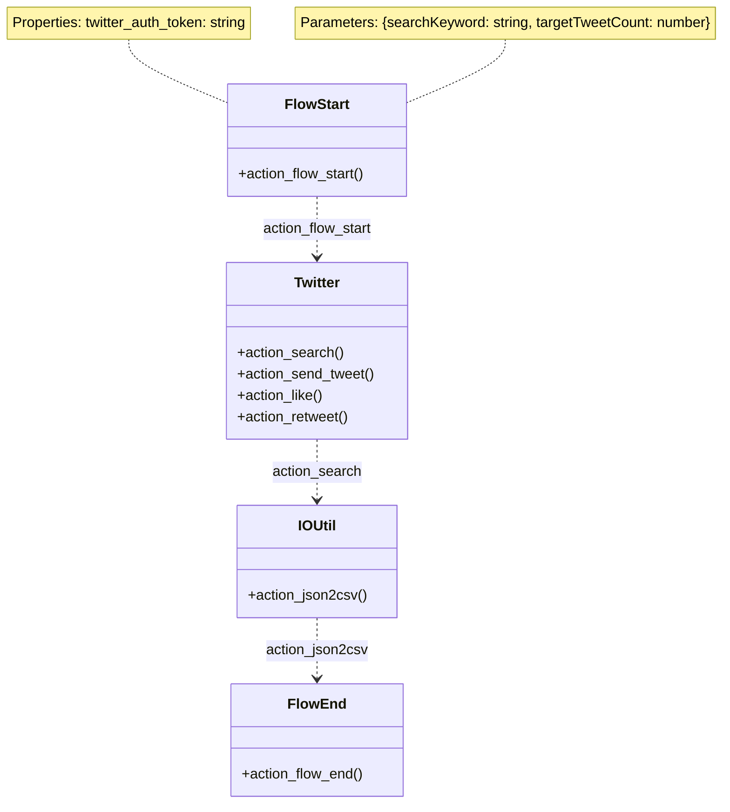

# Flow twitter_search_save_csv

This flow is used to search tweets from Twitter with `twitter_auth_token` and save the result to a csv file.

```mermaid
classDiagram
    class FlowStart {
        +action_flow_start()
    }
    
    class Twitter {
        +action_search()
        +action_send_tweet()
        +action_like()
        +action_retweet()
    }
    
    class IOUtil {
        +action_json2csv()
    }
    
    class FlowEnd {
        +action_flow_end()
    }

    %% Flow connections
    FlowStart ..> Twitter : action_flow_start
    Twitter ..> IOUtil : action_search
    IOUtil ..> FlowEnd : action_json2csv

    %% Properties and Parameters notes
    note for FlowStart "Properties: twitter_auth_token: string"
    note for FlowStart "Parameters: {searchKeyword: string, targetTweetCount: number}"
```